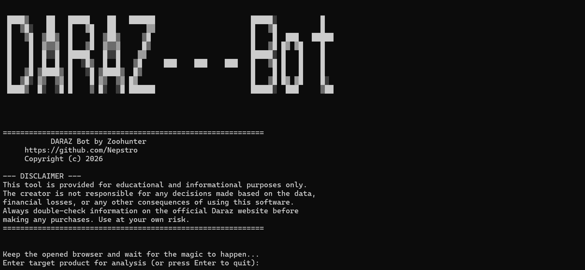

# Daraz Deep Search Price Anomaly Bot

This Python script is a powerful tool designed to scan Daraz.lk for significant price drops and potential pricing errors. It automates the process of crawling multiple pages of search results, analyzing market prices, and flagging items that are listed significantly below the calculated median price for that product category.

## 🚀 Features

-   **Deep Catalog Crawling**: Scans multiple pages of search results for a given product query.
-   **Advanced NLP & Trust Filtering**:
    -   **Strict Fuzzy Match**: Enforces strict keyword rules to prevent cross-contamination (e.g. stopping "Air Makeup" from appearing in an "Air Fryer" search).
    -   **RegEx Accessory Purge**: Uses a robust negative keyword dictionary (`rack`, `case`, `cover`, `makeup`, etc.) with automatic pluralization to annihilate non-product listings before they corrupt the math.
    -   **Trust Metrics**: Scrapes `Sold Count`, `Review Count`, and `Seller Location` to help you identify true deals versus abandoned or fake listings.
-   **Dynamic Anchor Pricing**: Calculates a highly accurate "true" market median based purely on Top-Relevance NLP matches, setting a dynamic price floor to protect against cheap off-brand garbage without punishing massive genuine discounts.
-   **MAD Anomaly Detection**: Replaces basic standard deviations with **Median Absolute Deviation (MAD)** and Modified Z-Scores. This mathematically isolates true pricing "glitches" (Z-Score <= -3.0) and is completely immune to extreme outliers (e.g. a $500,000 listing won't ruin the math).
-   **Persistent Alert Logging**: Remembers previously found deals in a `triggered_glitches_log.csv` to only notify you of *new* discoveries.
-   **Rich HTML Reports**: Generates a detailed, easy-to-read HTML report for each search, placing high-priority anomalies at the top and showcasing the new Trust Metrics alongside the product image.
-   **Automated Browser Handling**: Uses `seleniumbase` to manage the browser, including minimizing the window on startup to keep your terminal visible.

---

## 🛠️ How to Use

This bot is designed to be run on your local computer.

### Prerequisites

-   Python 3.x installed.
-   Google Chrome browser installed.

### Setup and Launch

**Easy Method (Recommended):**

1.  Download the project files. You can do this by clicking the green `<> Code` button on the GitHub page and selecting **"Download ZIP"**.
2.  Unzip the folder to a location on your computer.
3.  Simply double-click the `run_bot.bat` file. A terminal will open, automatically install the required libraries, and launch the application.

**Manual Launch (for developers):**

This method is for users who are comfortable with the command line and Git.

1.  **Clone the Repository:** Open your terminal and run the following command to download the project files.
    ```bash
    git clone https://github.com/Nepstro/Daraz-bot.git
    ```

2.  **Navigate into the Directory:**
    ```bash
    cd Daraz-bot
    ```
3.  **Install Required Libraries:**
    ```bash
    pip install pandas seleniumbase
    ```
4.  **Run the Script:**
    ```bash
    python Daraz_Bot_by_Nepstro.py
    ```
5.  Follow the interactive prompts in the terminal to start your search.

---

## ⚠️ Disclaimer

This tool is provided for educational and informational purposes only. The creator is not responsible for any decisions made based on the data, financial losses, or any other consequences of using this software. Always double-check information on the official Daraz website before making any purchases. Use at your own risk.

---

## 🏆 Credits

 -   **Author**: [Nepstro](https://github.com/Nepstro)